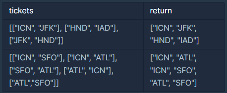

# 여행경로

## 문제설명 :

주어진 항공권을 모두 이용하여 여행경로를 짜려고 합니다. 항상 "ICN" 공항에서 출발합니다.

항공권 정보가 담긴 2차원 배열 tickets가 매개변수로 주어질 때, 방문하는 공항 경로를 배열에 담아 return 하도록 solution 함수를 작성해주세요.

---

## 제한사항

- 모든 공항은 알파벳 대문자 3글자로 이루어집니다.
- 주어진 공항 수는 3개 이상 10,000개 이하입니다.
- tickets의 각 행 [a, b]는 a 공항에서 b 공항으로 가는 항공권이 있다는 의미입니다.
- 주어진 항공권은 모두 사용해야 합니다.
- 만일 가능한 경로가 2개 이상일 경우 알파벳 순서가 앞서는 경로를 return 합니다.
- 모든 도시를 방문할 수 없는 경우는 주어지지 않습니다.

<br/>

---

## 입출력 예



<br/>

---

## 입출력 예 설명

### 입출력 예 #1

["ICN", "JFK", "HND", "IAD"] 순으로 방문할 수 있습니다.

<br/>

### 입출력 예 #2

["ICN", "SFO", "ATL", "ICN", "ATL", "SFO"] 순으로 방문할 수도 있지만 ["ICN", "ATL", "ICN", "SFO", "ATL", "SFO"] 가 알파벳 순으로 앞섭니다.

<br/>

## 답안 ( 내 풀이 ) :

```
function solution(tickets) {
    var answer = [];
    let visited = new Array(tickets.length).fill(false)
    let pathArr = ["ICN"]

    tickets.sort()

    const dfs = (array, visit, current , path ) => {
        if(path.length == tickets.length+1 && visit.every((x)=> x==true && answer.length == 0)){
            return answer = path
        }

        for(let i=0; i< tickets.length ; i++){
            if(!visit[i] && tickets[i][0] == current){
                visit[i] = true
                dfs(array, visit, tickets[i][1], [...path, tickets[i][1]], )
                visit[i] = false
            }
        }
    }

    dfs(tickets, visited, "ICN" , pathArr)

    return answer;
}
```
