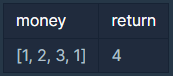

# 도둑질

## 문제설명 :

도둑이 어느 마을을 털 계획을 하고 있습니다. 이 마을의 모든 집들은 아래 그림과 같이 동그랗게 배치되어 있습니다.


각 집들은 서로 인접한 집들과 방범장치가 연결되어 있기 때문에 인접한 두 집을 털면 경보가 울립니다.

각 집에 있는 돈이 담긴 배열 money가 주어질 때, 도둑이 훔칠 수 있는 돈의 최댓값을 return 하도록 solution 함수를 작성하세요.

---

## 제한사항

- 이 마을에 있는 집은 3개 이상 1,000,000개 이하입니다.
- money 배열의 각 원소는 0 이상 1,000 이하인 정수입니다.

<br/>

---

## 입출력 예



<br/>

---

## 답안 ( 내 풀이 ) :

```
// 전꺼(i-1)와 전전꺼(i-2)에 현재(i)를 더한걸 비교해서 저장하는 방법.
// [1000, 1, 0, 1, 2, 1000, 0] 케이스 통과 불가. 답:2001 응답:2000
function solution(money) {
    var answer = 0;
    const n = money.length

    const dp1 = new Array(n).fill(0)
    const dp2 = new Array(n).fill(0)
    dp1[0] = money[0];
    dp2[1] = money[1];

    for(let i = 2; i < n; i++) {
        dp1[i] = Math.max(dp1[i-2] + money[i], dp1[i-1]);
        dp2[i] = Math.max(dp2[i-2] + money[i], dp2[i-1]);
    }

    answer = Math.max(dp1[n-2],dp2[n-1])

    return answer;
}

// 이전까지의 최대합을 더해가며 구하는 방법.
// 전전전(i-3)이 없다면 0을, 있다면 전전전(i-3)과 전전(i-2)중 더 큰값을 더해가며 저장.
function solution(money) {
    var answer = 0;
    const n = money.length

    const dp1 = money.slice(0, money.length - 1)
    const dp2 = money.slice(1)

    for(let i = 2; i < n-1; i++) {
        dp1[i] += Math.max(dp1[i - 2], dp1[i - 3] || 0);
        dp2[i] += Math.max(dp2[i - 2], dp2[i - 3] || 0);
    }

    answer = Math.max(dp1[n - 2], dp1[n - 3], dp2[n - 2], dp2[n - 3])

    return answer;
}
```
