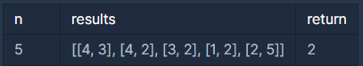

# 순위

## 문제설명 :

n명의 권투선수가 권투 대회에 참여했고 각각 1번부터 n번까지 번호를 받았습니다. 권투 경기는 1대1 방식으로 진행이 되고, 만약 A 선수가 B 선수보다 실력이 좋다면 A 선수는 B 선수를 항상 이깁니다. 심판은 주어진 경기 결과를 가지고 선수들의 순위를 매기려 합니다. 하지만 몇몇 경기 결과를 분실하여 정확하게 순위를 매길 수 없습니다.

선수의 수 n, 경기 결과를 담은 2차원 배열 results가 매개변수로 주어질 때 정확하게 순위를 매길 수 있는 선수의 수를 return 하도록 solution 함수를 작성해주세요.

---

## 제한사항

- 선수의 수는 1명 이상 100명 이하입니다.
- 경기 결과는 1개 이상 4,500개 이하입니다.
- results 배열 각 행 [A, B]는 A 선수가 B 선수를 이겼다는 의미입니다.
- 모든 경기 결과에는 모순이 없습니다.

<br/>

---

## 입출력 예



<br/>

---

## 입출력 예 설명

2번 선수는 [1, 3, 4] 선수에게 패배했고 5번 선수에게 승리했기 때문에 4위입니다.
5번 선수는 4위인 2번 선수에게 패배했기 때문에 5위입니다.

<br/>

---

## 답안 ( 내 풀이 ) :

```
function solution(n, results) {
    var answer = 0;
    const dp = Array.from({ length: n + 1 }, () => Array(n + 1).fill(false));

    // 주어진 배열을 가지고 결과 저장.
    for(let [A,B] of results){
        dp[A][B] = 1;       // 이긴 선수는 1
        dp[B][A] = -1;      // 진 선수는 -1
        dp[A][A] = 0;       // 본인 0
        dp[B][B] = 0;
    };

    // 선수 번호를 저장하는 배열 [1, 2, 3, ... , n] 을 생성
    const range = [...Array(n).keys()].map(e => e + 1);

    // 주어진 results를 가지고 만든 배열dp 로 나머지 상관 관계 저장.
    for (const mid of range) {
        for (const A of range) {
            for (const B of range) {
                // A 가 mid를 이기고, mid가 B를 이긴 경우
                if (dp[A][mid] === 1 && dp[mid][B] === 1) {
                    dp[A][B] = 1;
                } else if (dp[A][mid] === -1 && dp[mid][B] === -1) {
                    // B가 mid를 이기고, mid가 A를 이긴 경우
                    dp[A][B] = -1;
                }
            }
        }
    }

    // 모든 결과가 담긴 배열 dp를 가지고 순위를 알수 있는 선수 추출.
    for(let result of dp){
        if(result.filter(x => x !== false).length == n ) answer++
    }

    return answer;
}
```
