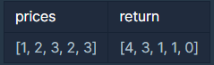

# 주식가격

## 문제설명 :

초 단위로 기록된 주식가격이 담긴 배열 prices가 매개변수로 주어질 때, 가격이 떨어지지 않은 기간은 몇 초인지를 return 하도록 solution 함수를 완성하세요.

---

## 제한사항

- prices의 각 가격은 1 이상 10,000 이하인 자연수입니다.
- prices의 길이는 2 이상 100,000 이하입니다.

<br/>

---

## 입출력 예



<br/>

---

## 입출력 예 설명

- 1초 시점의 ₩1은 끝까지 가격이 떨어지지 않았습니다.
- 2초 시점의 ₩2은 끝까지 가격이 떨어지지 않았습니다.
- 3초 시점의 ₩3은 1초뒤에 가격이 떨어집니다. 따라서 1초간 가격이 떨어지지 않은 것으로 봅니다.
- 4초 시점의 ₩2은 1초간 가격이 떨어지지 않았습니다.
- 5초 시점의 ₩3은 0초간 가격이 떨어지지 않았습니다.

<br/>

---

## 답안 ( 내 풀이 ) :

```
// No Stack
function solution(prices) {
    var answer = [];

    for(let i=0; i< prices.length-1; i++){
        let time = 1
        for(let j=i+1; j< prices.length-1; j++){
            if(prices[i]>prices[j]){
                break;
            }else{
                time++
            }
        }
        answer.push(time)
    }
    answer.push(0)

    return answer;
}


// Stack
function solution(prices) {
    const answer = new Array(prices.length).fill(0);
    const stack = [];

    for(let i = 0; i < prices.length; i++) {
        while(stack.length && prices[i] < prices[stack.at(-1)]) {
            let temp = stack.pop();
            answer[temp] = i - temp;
        }
        stack.push(i);
    }

    while(stack.length) {
        let temp = stack.pop();
        answer[temp] = prices.length - temp - 1;
    }

    return answer;
}
```
